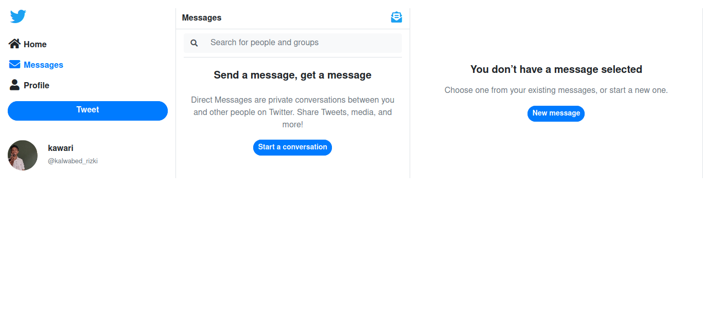

# Seperti Twitter

Proyek sekolah saya membuat kerangka web seperti [Twitter](https://twitter.com) menggunakan HTML.

## Peralatan

- [Bootstrap 4.5](https://getbootstrap.com) (css framework)
- [serve](https://www.npmjs.com/package/serve) (untuk menjalankan server lokal)
- [Notion](https://notion.so) (membuat catatan dan readme)

## Referensi

- [Profil saya](https://twitter.com/kalwabed_rizki)

## Pemilik

[kalwabed](https://github.com/kaliwa)

## Lisensi

MIT
